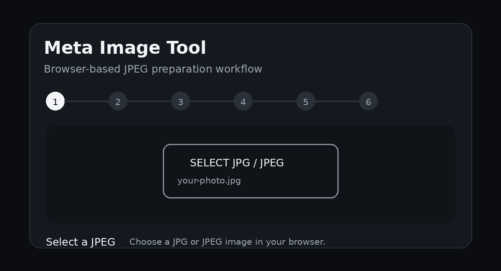

Meta Image Tool

  <strong>A lightweight, browser-based JPEG preparation and metadata tool.</strong> 
  No server. No upload. No external JavaScript library.

  

✨ What it does

Meta Image Tool takes an image and prepares a standardized JPEG directly in your browser.

The conversion pipeline:

Image
  ↓
Read EXIF orientation
  ↓
Physically correct orientation
  ↓
Proportional 3:4 center crop
  ↓
Resize to 3024 × 4032
  ↓
Re-encode as clean JPEG
  ↓
Write minimal EXIF
  ↓
Copy Base64 + download JPEG

📸 Output

The generated image is:

3024 × 4032 pixels

3:4 aspect ratio

Corrected for the source image's EXIF orientation

Center-cropped proportionally instead of being stretched

Re-encoded as JPEG

Given a minimal EXIF block

Available as a downloadable JPEG

Base64 can also be copied to the clipboard

🏷️ Metadata written

The tool intentionally writes only a small set of EXIF fields:

EXIF field

Output

Make

Meta AI

Model

Ray-Ban Meta Smart Glasses 2

Orientation

1

Color Space

sRGB

Pixel X Dimension

3024

Pixel Y Dimension

4032

GPS

Removed

Important: EXIF metadata describes what a file claims about an image. Writing a device/model value does not make the image genuinely captured by that device.

🍎 iPhone & Safari support

The tool is designed to work with images from modern iPhone workflows and Safari.

For JPEG images, the application reads the EXIF orientation and physically corrects the image before writing Orientation = 1.

The conversion uses a Blob-based JPEG workflow rather than relying on a large Base64 data URL for downloading. This provides a more reliable download path in Safari.

HEIC/HEIF files are accepted when the browser can decode them natively. Browser support for HEIC/HEIF decoding can vary by device and browser.

🔐 Privacy

Everything happens locally in the browser.

The image is not uploaded to a backend by this project. The conversion uses browser APIs such as:

FileReader

Blob

Canvas

Clipboard API

Browser JPEG encoding

This makes the project suitable for client-side image processing without maintaining an image-processing server.

🛠️ Tech

The project is intentionally dependency-free:

HTML

CSS

Vanilla JavaScript

HTML Canvas

JPEG / EXIF byte-level handling

There is no PiexifJS dependency and no external CDN required.

🚀 Run locally

Clone the repository:

git clone https://github.com/climatesultan/meta-image-tool.git
cd meta-image-tool

Then open:

index.html

in a browser.

For the best clipboard behavior, use the GitHub Pages deployment or another HTTPS origin.

🌐 GitHub Pages

The project can be hosted directly from the repository using GitHub Pages.

Live application:

https://climatesultan.github.io/meta-image-tool/

📁 Project structure

meta-image-tool/
├── index.html
├── README.md
└── workflow.gif

The entire application currently lives in a single HTML file, making it easy to inspect, fork, modify, and deploy.

🎯 Why this project?

The goal is to provide a small, transparent image-processing utility where the complete workflow is visible in the source code.

Instead of relying on a server-side conversion pipeline or a large dependency, the project performs the important operations directly in the browser.

👤 Made by

Mr. Gokul — Climate Sultan

Created and developed by Mr. Gokul (Climate Sultan).

  <strong>Meta Image Tool</strong> 
  Built with HTML, CSS & Vanilla JavaScript.

